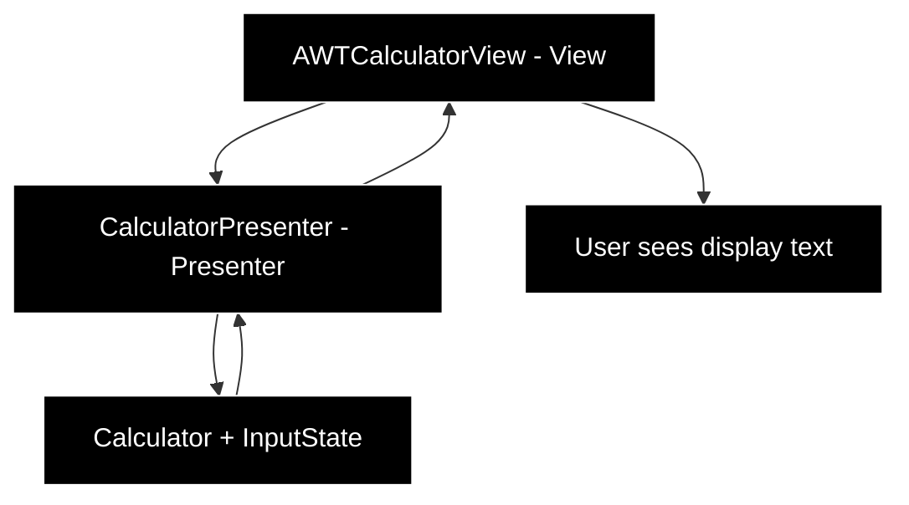

# Mini Calculator

This project is a basic calculator with a GUI interface to exercise TDD, Object Oriented Programming and learning more
GUI programming with Java and AWT library.

## Features

* Infix basic mathematical expression parsing and evaluation (e.g.: `((5 - 2) / 3) * 1.5`)
* Supported operators: `+`, `-`, `*`, `/`, `%`, `√`
* Supported numbers set: `Real Numbers`
* Supported modes: `Basic` and `Scientific`

## Architectural Patterns

* [Modular Monolith](https://medium.com/design-microservices-architecture-with-patterns/microservices-killer-modular-monolithic-architecture-ac83814f6862)
  for the project overall structure
* [Model-View-Presenter](https://www.geeksforgeeks.org/android/mvp-model-view-presenter-architecture-pattern-in-android-with-example/)
  for the UI

### Diagram


## Integration Tests Using DSL

The DSL (Domain-Specific Language) is a small fluent API to write integration tests in a readable, natural way, simulating how a user interacts with the calculator.

**Why use it:**

* Makes tests easy to read and understand, almost like plain English.
* Reduces boilerplate code for clicking buttons, switching modes, and checking the display.
* Encapsulates AWT event handling so tests are clean and focused on behavior, not implementation.

### Sample

```java
import static org.gbl.gui.integration.AWTCalculatorDSL.calculator;

public class CalculatorIntegrationExample {

    @Test
    void calculatorTest() throws Exception {
        calculator()
            .type("2", "+", "2")
            .equals()
            .shouldDisplay("4.0")
            .clear()
            .type("√", "16")
            .equals()
            .shouldDisplay("4.0")
            .scientificMode()
            .type("sin", "0")
            .equals()
            .shouldDisplay("0.0")
            .basicMode();
    }
}
```

## WIP

* Calculator modules:
    * Scientific - trigonometry

## Images


### Modes


### Basic


### Scientific


